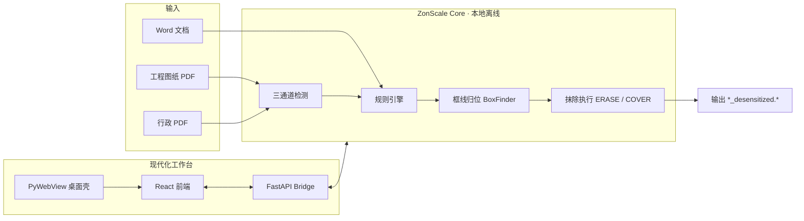

<p align="center">
  
</p>

<h1 align="center">ZonScale</h1>

<p align="center">
  <strong>本地离线 · 日用百宝箱</strong><br/>
  <em>工程图纸脱敏为核心 · PDF / PPT / 图像 / 音视频 / 文本 / 计算 / 系统工具一站处理 · by zonlic</em>
</p>

<p align="center">
  
  
  
  
  
  
  
</p>

<p align="center">
  读入客户 PDF 工程图纸与办公文档，在<strong>框线约束内</strong>精准抹除敏感词、Logo 与保密标记。<br/>
  同一工作台还集成了 PDF、PPT、图像、音视频、文本、计算与系统硬件工具——<strong>70+ 项全部本地离线运行</strong>。<br/>
  文件不出本机，不修改原始文件，脱敏输出 <code>原名_desensitized</code> 后缀副本。
</p>

---

## 8 大中心

| 中心 | 能力 |
| --- | --- |
| 🛡️ **智能脱敏** | 工程图纸 / 行政 PDF / Word 三入口，三通道检测 + 框线归位，规则中心 + 审计日志 |
| 📄 **PDF 工坊** | 24 项：合并、拆分、提取、旋转、裁剪、页码、压缩、转 Word/Excel/PPT、OCR 导出、编辑、水印、增强、填表、加密、解密、证书签名 |
| 📊 **PPT 工坊** | 转 PDF / 图片、图片批量导入、文字提取、压缩、大纲、AI 底稿 |
| 🖼️ **图像工坊** | 裁剪、换色、格式转换、压缩、拼接、图标生成、取色、色彩空间对比 |
| 🎵 **音视频中心** | BPM 检测、音频剪辑 / 转码 / 提取、视频转码 / 抽帧 / 转 GIF |
| ✍️ **文本工坊** | Markdown 编辑器、字数统计、文本格式化、语音转写、打字测速 |
| 🧮 **计算开发** | BMI、时间戳、房贷、复利、密码生成、JSON、Base64、URL 编解码、UUID、JWT、哈希加密 |
| 💻 **系统硬件** | 硬件总览、CPU / 内存、GPU / 显示器、主板、存储、功耗传感器、大文件 / C 盘清理 |

---

## 为什么选 ZonScale

| 维度 | ZonScale |
| --- | --- |
| **数据安全** | 零云端、零外网请求，图纸与文档不出本机 |
| **工程图纸** | 矢量 + OCR + 视觉三通道融合，框线归位后抹除，不污染尺寸与公差 |
| **办公文档** | 通用行政 PDF、Word 文档同一工作台处理 |
| **规则治理** | 规则中心 + 外部词表 / Logo 模板，按需自选公司名等脱敏规则，支持 GUI 热重载 |
| **交付形态** | Windows EXE 一键启动 · 手机网页版（浏览器内处理，无需安装） |

---

## 桌面版 vs 手机网页版

| | 桌面版 EXE | 手机网页版 |
| --- | --- | --- |
| 形态 | Windows 一键启动 | 手机浏览器直接打开，无需安装 |
| 引擎 | 本机完整引擎（FastAPI + PyMuPDF + RapidOCR + Office COM） | 浏览器内引擎（pdf-lib / PDF.js / Web Crypto 等纯前端实现） |
| 能力 | 全部功能 | 全部「纯前端可实现」的工具；需本机引擎的（脱敏、Office 转换、OCR 等）会提示改用桌面版 |
| 文件流 | 全程本机 | 文件只在浏览器内处理，不上传任何服务器 |

> 手机端只对「确实无法在浏览器实现」的工具提示下载桌面版，其余工具照常使用。

---

## 系统架构



---

## 快速开始

### 方式一 · Windows 可执行文件（推荐）

1. 从 GitHub Releases 下载最新 EXE 压缩包，或本机运行 `build_zonscale_exe.bat` 构建
2. 双击 **启动现代化脱敏工作台.bat** 或直接运行 exe
3. 浏览器 / 内嵌窗口访问 `http://127.0.0.1:8765`

### 方式二 · 手机网页版（无需安装）

- 局域网：电脑运行「启动局域网手机访问.bat」，手机同 WiFi 打开提示地址
- 公网：电脑运行「启动公网手机访问.bat」（Cloudflare 隧道），任何网络可用

### 方式三 · 源码开发模式

```powershell
# 克隆（需仓库访问权限）
git clone https://github.com/zonlic0925-boop/Zonscale.git
cd Zonscale

# Python 依赖
pip install -r requirements.txt

# 前端构建
cd frontend
npm install
npm run build
cd ..

# 启动现代化工作台
python run_modern_app.py
# 或
.\启动现代化脱敏工作台.bat
```

---

## 技术栈

| 层级 | 选型 |
| --- | --- |
| 前端 | React · TypeScript · Tailwind CSS · Vite |
| 前端离线引擎 | pdf-lib · PDF.js · Web Crypto · Office JS（浏览器内处理，零上传） |
| 桥接 | FastAPI · Uvicorn |
| 桌面 | PyWebView · PyInstaller |
| PDF | PyMuPDF 1.27 · OpenCV |
| OCR | RapidOCR ONNX Runtime |
| 文档 | python-docx · python-pptx |
| 测试 | pytest · Playwright |

---

## 目录结构（节选）

```
Zonscale/
├── core/                 # 脱敏核心：检测 · 归位 · 执行 · 管道
├── frontend/             # React 现代化 UI（8 大中心）
├── server_bridge.py      # FastAPI 本地桥接
├── desktop_app.py        # PyWebView 桌面入口
├── rules/                # 敏感词表与 Logo 模板（可配置）
├── packaging/            # Windows / macOS 打包脚本
├── scripts/              # 发布验收 · 公网隧道 · 干净导出
├── tests/                # 单元测试与发布契约
└── run_modern_app.py     # 开发模式启动器
```

---

## 数据安全承诺

- **不联网**：运行时无外部 API、无云 OCR、无模型上传
- **不改原文件**：只在用户指定目录写入 `_desensitized` 副本
- **样本隔离**：客户图纸目录 `Testing Drawings/` 已加入 `.gitignore`，不会进入版本库
- **私有仓库**：本仓库为 Private，仅供授权协作者访问

---

## 验收标准（产品级）

1. **文本层零命中**：输出 PDF 全文检索敏感词 → 0 命中
2. **渲染目检**：抹除块不越框线、不污染框外标注
3. **样本回归**：`Testing Drawings/` 全量三通道跑通并归档审计

---

## 作者

**zonlic** — 一個在香港生存的普通人

<p align="center">
  <sub>Private repository · ZonScale © zonlic</sub>
</p>
