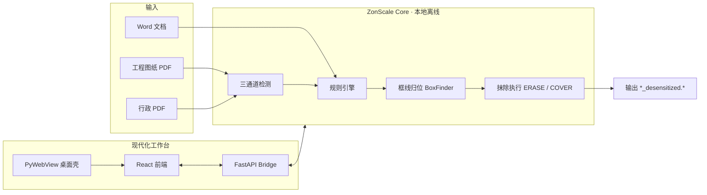

<p align="center">
  
</p>

<h1 align="center">ZonScale</h1>

<p align="center">
  <strong>工程图纸与文档 · 本地离线智能脱敏工作台</strong><br/>
  <em>by zonlic</em>
</p>

<p align="center">
  
  
  
  
  
  
</p>

<p align="center">
  读入客户 PDF 工程图纸与办公文档，在<strong>框线约束内</strong>精准抹除<strong>用户配置的</strong>敏感词、Logo 与保密标记。<br/>
  产品<strong>不内置任何公司名或专有词表</strong>，全部规则由外部文件或规则中心自行维护。<br/>
  全程本地运行，不修改原始文件，输出 <code>原名_desensitized</code> 后缀副本。
</p>

---

## 为什么选 ZonScale

| 维度 | ZonScale |
| --- | --- |
| **数据安全** | 零云端、零外网请求，图纸与文档不出本机 |
| **工程图纸** | 矢量 + OCR + 视觉三通道融合，框线归位后抹除，不污染尺寸与公差 |
| **办公文档** | 通用行政 PDF、Word 文档同一工作台处理 |
| **规则治理** | 外部词表 + Logo 模板，GUI 热重载；**零内置公司名**，由用户自行配置 |
| **交付形态** | Windows exe 一键启动 · 支持局域网手机预览 |

> **ZonScale** 与开源项目 [Desensitization](https://github.com/zonlic0925-boop/Desensitization) 是<strong>两个独立项目</strong>：Desensitization 聚焦 CLI / PyQt 图纸脱敏核心；ZonScale 是面向交付的现代化工作台产品（React UI + 桌面壳 + 多格式扩展）。

---

## 功能模块

<table>
<tr>
<td width="50%">

### 工程图纸脱敏
- 文字层 PDF → 矢量通道（Span 坐标）
- 纯栅格 PDF → 300 DPI + RapidOCR
- 混合 PDF → 双通道 IoU 融合
- Logo → XObject + 模板匹配
- 框线归位 → 单元格内抹除，越框即标「待人工确认」

</td>
<td width="50%">

### 通用行政公文
- 扫描件 / 电子版 PDF 统一入口
- 敏感词命中预览与勾选
- 导出脱敏 PDF，支持自定义目录

</td>
</tr>
<tr>
<td>

### Word 文档脱敏
- `.docx` 段落级敏感词识别
- 高亮预览 + 批量替换导出
- 与图纸规则库共享词表

</td>
<td>

### 规则 · 审计
- `rules/sensitive_terms.txt` — 用户自备敏感词表（产品不预置任何公司名）
- `rules/logos/` — 用户自备 Logo 视觉模板
- 每次执行生成结构化审计 JSON

</td>
</tr>
</table>

---

## 系统架构



---

## 快速开始

### 方式一 · Windows 可执行文件（推荐）

1. 下载或构建 `dist/ZonScale/ZonScale.exe`
2. 双击 **启动现代化脱敏工作台.bat** 或直接运行 exe
3. 浏览器 / 内嵌窗口访问 `http://127.0.0.1:8765`

### 方式二 · 源码开发模式

```powershell
# 克隆（需仓库访问权限）
git clone https://github.com/zonlic0925-boop/Zonscale.git
cd Zonscale

# Python 依赖
pip install -r requirements.txt

# 前端构建
cd frontend
npm install
npm run build
cd ..

# 启动现代化工作台
python run_modern_app.py
# 或
.\启动现代化脱敏工作台.bat
```

### 方式三 · 经典 PyQt 图纸脱敏（CLI / 旧版 UI）

```powershell
pip install -r requirements.txt
python main_ui.py          # PyQt5 图形界面
python main.py input.pdf   # CLI 批处理
```

---

## 技术栈

| 层级 | 选型 |
| --- | --- |
| 前端 | React · TypeScript · Tailwind CSS · Vite |
| 桥接 | FastAPI · Uvicorn |
| 桌面 | PyWebView · PyInstaller |
| PDF | PyMuPDF 1.27 · OpenCV |
| OCR | RapidOCR ONNX Runtime |
| 文档 | python-docx |
| 测试 | pytest |

---

## 目录结构（节选）

```
Zonscale/
├── core/                 # 脱敏核心：检测 · 归位 · 执行 · 管道
├── frontend/             # React 现代化 UI
├── server_bridge.py      # FastAPI 本地桥接
├── desktop_app.py        # PyWebView 桌面入口
├── rules/                # 敏感词表与 Logo 模板（可配置）
├── packaging/            # Windows / macOS 打包脚本
├── tests/                # 单元测试与发布契约
└── run_modern_app.py     # 开发模式启动器
```

---

## 数据安全承诺

- **不联网**：运行时无外部 API、无云 OCR、无模型上传
- **不改原文件**：只在用户指定目录写入 `_desensitized` 副本
- **样本隔离**：客户图纸目录 `Testing Drawings/` 已加入 `.gitignore`，不会进入版本库
- **私有仓库**：本仓库为 Private，仅供授权协作者访问

---

## 验收标准（产品级）

1. **文本层零命中**：输出 PDF 全文检索敏感词 → 0 命中
2. **渲染目检**：抹除块不越框线、不污染框外标注
3. **样本回归**：`Testing Drawings/` 全量三通道跑通并归档审计

---

## 作者

**zonlic** — 一個在香港生存的普通人

<p align="center">
  <sub>Private repository · ZonScale © zonlic · 与 Desensitization 开源项目独立维护</sub>
</p>
