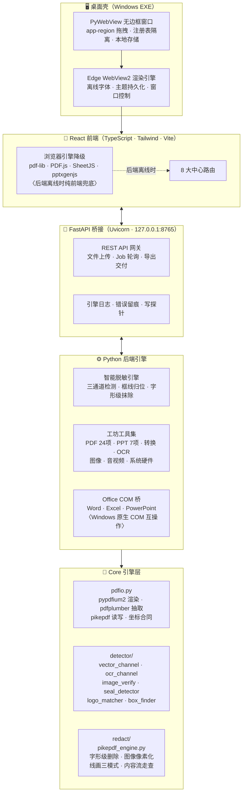

<p align="center">
  
</p>

<h1 align="center">ZonKey</h1>

<p align="center">
  <strong>本地离线 · 日用百宝箱</strong><br/>
  <em>智能脱敏为核心 · PDF / PPT / 图像 / 音视频 / 文本 / 计算 / 系统 8 大中心 70+ 工具 · by zonlic</em>
</p>

<p align="center">
  
  
  
  
  
  
  
  
</p>

<p align="center">
  读入客户 PDF 工程图纸与办公文档，在<strong>框线约束内</strong>精准抹除敏感词、Logo 与保密标记。<br/>
  同一工作台还集成了 PDF、PPT、图像、音视频、文本、计算与系统硬件工具——<strong>70+ 项全部本地离线运行</strong>。<br/>
  文件不出本机，不修改原始文件，脱敏输出 <code>原名_desensitized</code> 后缀副本。
</p>

---

## 系统架构

ZonKey 是一个**三端一体**的离线应用：桌面壳（pywebview）、Web 前端（React）、Python 后端引擎（FastAPI），三者在同一本机进程内协同工作。



### 三层递进理解

| 层级 | 运行位置 | 核心职责 |
| --- | --- | --- |
| **桌面壳** | 本机 EXE 进程 | 窗口管理、WebView2 宿主、注册表隔离、闪屏联动 |
| **Web 前端** | 壳内 WebView2 / 手机浏览器 | 8 中心 UI、浏览器引擎降级、主题/字号/收藏持久化 |
| **Python 后端** | 本机 FastAPI 进程 | 脱敏引擎、PDF 工坊、Office 转换、系统硬件探针 |

> **手机网页版**（[zonkey.pages.dev](https://zonkey.pages.dev)）剥离了 Python 后端，所有工具走浏览器引擎降级——文件仅在浏览器内处理，不上传任何服务器。需要本机引擎的功能（脱敏、OCR、Office 转换）会提示改用桌面版。

---

## 8 大中心

| 中心 | 能力 |
| --- | --- |
| 🛡️ **智能脱敏** | 工程图纸 / 行政 PDF / Word 三入口，三通道检测 + 框线归位，规则中心 + 审计日志 |
| 📄 **PDF 工坊** | 24 项：合并、拆分、提取、旋转、裁剪、页码、压缩、转 Word/Excel/PPT、OCR 导出、编辑、水印、增强、填表、加密、解密、证书签名 |
| 📊 **PPT 工坊** | 转 PDF / 图片、图片批量导入、文字提取、压缩、大纲、AI 底稿 |
| 🖼️ **图像工坊** | 裁剪、换色、格式转换、压缩、拼接、图标生成、取色、色彩空间对比 |
| 🎵 **音视频中心** | BPM 检测、音频剪辑 / 转码 / 提取、视频转码 / 抽帧 / 转 GIF |
| ✍️ **文本工坊** | Markdown 编辑器、字数统计、文本格式化、语音转写、打字测速 |
| 🧮 **计算开发** | BMI、时间戳、房贷、复利、密码生成、JSON、Base64、URL 编解码、UUID、JWT、哈希加密 |
| 💻 **系统硬件** | 硬件总览、CPU / 内存、GPU / 显示器、主板、存储、功耗传感器、大文件 / C 盘清理 |

---

## 为什么选 ZonKey

| 维度 | ZonKey |
| --- | --- |
| **数据安全** | 零云端、零外网请求，图纸与文档不出本机 |
| **工程图纸** | 矢量 + OCR + 视觉三通道融合，框线归位后抹除，不污染尺寸与公差 |
| **办公文档** | 通用行政 PDF、Word 文档同一工作台处理 |
| **规则治理** | 规则中心 + 外部词表 / Logo 模板，按需自选公司名等脱敏规则，支持 GUI 热重载 |
| **交付形态** | Windows EXE 一键启动 · 手机网页版（浏览器内处理，无需安装） |

---

## 桌面版 vs 手机网页版

| | 桌面版 EXE | 手机网页版 |
| --- | --- | --- |
| 形态 | Windows 一键启动 | 手机浏览器直接打开，无需安装 |
| 引擎 | 本机完整引擎（FastAPI + PyMuPDF + RapidOCR + Office COM） | 浏览器内引擎（pdf-lib / PDF.js / Web Crypto 等纯前端实现） |
| 能力 | 全部功能 | 全部「纯前端可实现」的工具；需本机引擎的（脱敏、Office 转换、OCR 等）会提示改用桌面版 |
| 文件流 | 全程本机 | 文件只在浏览器内处理，不上传任何服务器 |

> 手机端只对「确实无法在浏览器实现」的工具提示下载桌面版，其余工具照常使用。

---

## 快速开始

### 方式一 · Windows 一键安装（推荐）

| 下载源 | 说明 |
| --- | --- |
| [**GitHub Release**](https://github.com/zonlic0925-boop/ZonKey/releases)（主） | 仓库已公开，无需登录；含 **Setup 安装包**（推荐）与便携压缩包两种 |
| [**Gitee Release**](https://gitee.com/zonlic/ZonKey/releases)（国内镜像） | 国内下载更快；大文件分卷时合并命令见 Release 说明 |

- **Setup 安装包**（`ZonKey_Setup_x64_*.exe`）：双击一路下一步，自动创建桌面/开始菜单快捷方式，卸载干净。
- **便携版**（`ZonKey_Windows_x64_*.zip` / `.7z`）：解压即用，免安装，双击 `ZonKey.exe`。

> 下载的文件均附 SHA256 校验值，可在 Release 页面核对完整性。软件内「帮助」按钮有完整使用说明。

### 方式二 · macOS

**自动构建（零本机环境）**：仓库配置了 GitHub Actions（`.github/workflows/macos-dmg.yml`），每次推送 master 或打 `v*` tag 都会在 macOS runner 上自动构建 **Apple Silicon + Intel 两个 DMG**——在仓库 Actions 页或 Release 附件直接下载。

在 **Mac 上**手动执行以下任意一条：

```bash
# A. 源码构建（已装 Python 3.11 + Node 18+）
git clone https://github.com/zonlic0925-boop/ZonKey.git
cd ZonKey && pip install -r requirements.txt && cd frontend && npm install && npm run build && cd ..
./build_zonkey_mac.sh          # 产物：dist/ZonKey.app

# B. 构建包（Mac 上无需 Node）
#    从 Release 下载 ZonKey_mac_build_kit_*.zip，解压后：
python3.11 -m venv .venv && source .venv/bin/activate
pip install -r requirements.txt
./build_zonkey_mac.sh          # 产物：dist/ZonKey.app + dist_release/ZonKey_macOS_*.zip
```

> 完整步骤与故障排查见 `packaging/macos/MAC_BUILD_ON_MAC.md`（构建包内含副本）。
> 首次打开：右键 ZonKey.app → 打开（未公证应用需此步）；数据目录 `~/Library/Application Support/ZonKey/`。

### 方式三 · 手机网页版（无需安装）

- 局域网：电脑运行「启动局域网手机访问.bat」，手机同 WiFi 打开提示地址
- 或直接访问 **[zonkey.pages.dev](https://zonkey.pages.dev)**

### 方式四 · 源码开发模式

```powershell
# 克隆（GitHub 主仓库）
git clone https://github.com/zonlic0925-boop/ZonKey.git
# 或 Gitee 国内镜像
git clone https://gitee.com/zonlic/ZonKey.git
cd ZonKey

# Python 依赖
pip install -r requirements.txt

# 前端构建
cd frontend
npm install
npm run build
cd ..

# 启动现代化工作台
python run_modern_app.py
# 或
.\启动现代化脱敏工作台.bat
```

---

## 技术栈

| 层级 | 选型 |
| --- | --- |
| 前端 | React · TypeScript · Tailwind CSS · Vite |
| 前端离线引擎 | pdf-lib · PDF.js · Web Crypto · SheetJS · pptxgenjs · mammoth · html2canvas（浏览器内处理，零上传） |
| 桥接 | FastAPI · Uvicorn |
| 桌面 | PyWebView · PyInstaller |
| PDF | pypdfium2 · pikepdf · pdfplumber · reportlab |
| OCR | RapidOCR ONNX Runtime |
| 文档 | python-docx · python-pptx · openpyxl |
| 测试 | pytest · Playwright |

---

## 目录结构

```
ZonKey/
├── core/                    # 脱敏引擎核心
│   ├── pdfio.py             #   统一 PDF 读写层（pypdfium2/pikepdf/pdfplumber）
│   ├── detector/            #   检测通道（矢量/OCR/视觉/印章/Logo）
│   ├── redact/              #   抹除执行（pikepdf 字形级删除 + 图像像素化）
│   └── pipeline.py          #   脱敏流水线编排
├── frontend/                # React 现代化 UI
│   ├── src/
│   │   ├── components/      #   视图组件（8 大中心 + 通用组件）
│   │   ├── lib/zonkey/      #   纯前端工具引擎（15+ 模块）
│   │   └── i18n/            #   三语国际化（zh-CN / zh-TW / en）
│   └── public/              #   静态资产（图标 · 字体 · PWA manifest）
├── server_bridge.py         # FastAPI 本地桥接（REST API + Job 轮询）
├── desktop_app.py           # PyWebView 桌面壳入口（无边框窗口 + WebView2）
├── backend_*.py             # 后端工具集（convert / media / ppt / system / p3）
├── rules/                   # 敏感词表与 Logo 模板（用户可配置）
├── packaging/               # Windows / macOS 打包脚本与配置
├── scripts/                 # 发布验收 · 图标生成 · 公网隧道 · 干净导出
├── tests/                   # 单元测试与发布契约
└── run_modern_app.py        # 开发模式启动器
```

---

## 数据安全承诺

- **不联网**：运行时无外部 API、无云 OCR、无模型上传
- **不改原文件**：只在用户指定目录写入 `_desensitized` 副本
- **样本隔离**：客户图纸目录 `Testing Drawings/` 已加入 `.gitignore`，不会进入版本库
- **开源公开**：本仓库已公开（MIT），面向公开发布与通用客户场景

---

## 验收标准（产品级）

1. **文本层零命中**：输出 PDF 全文检索敏感词 → 0 命中
2. **渲染目检**：抹除块不越框线、不污染框外标注
3. **样本回归**：`Testing Drawings/` 全量三通道跑通并归档审计

---

## 作者

**zonlic** — 一個在香港生存的普通人

<p align="center">
  <sub>Public repository · ZonKey © zonlic</sub>
</p>