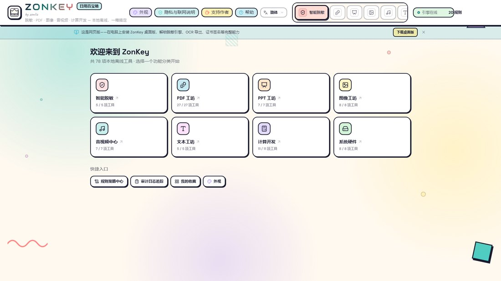
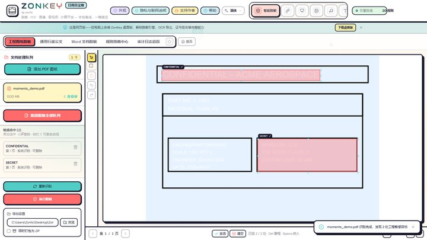
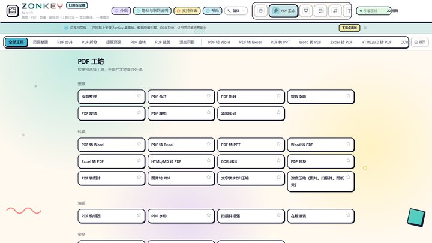
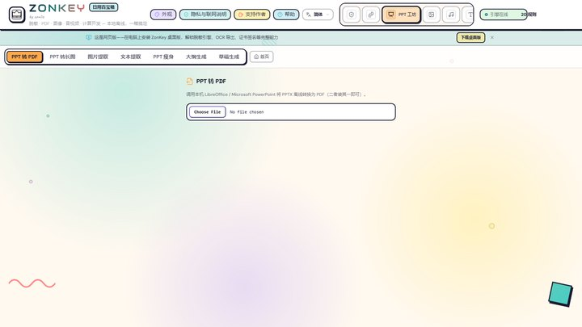
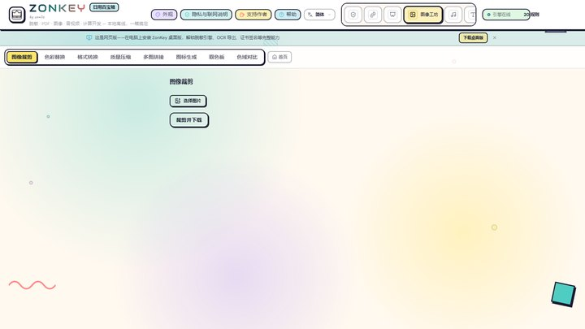
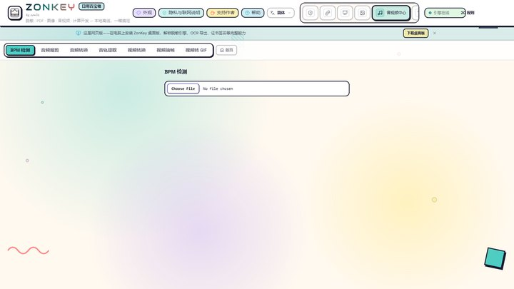
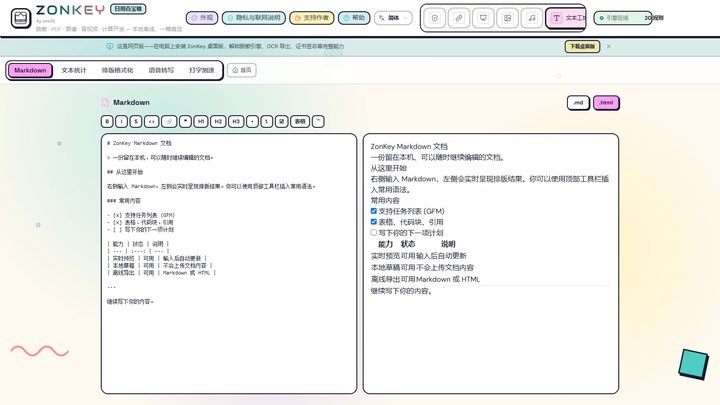
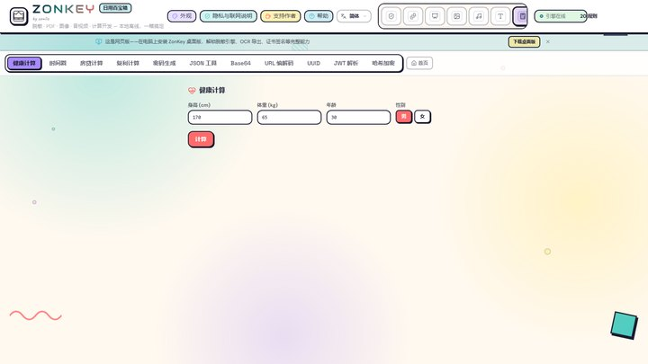
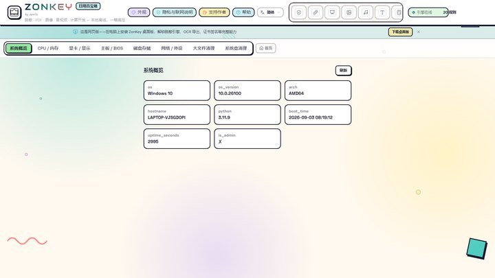
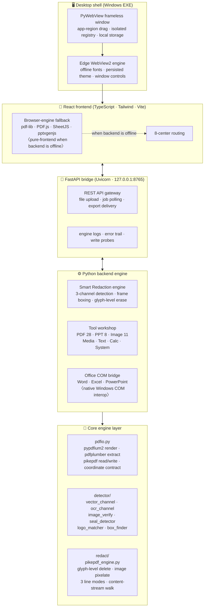

<p align="center">
  <a href="README.md"><strong>简体中文</strong></a> · <strong>English</strong>
</p>

<p align="center">
  
</p>

<h1 align="center">ZonKey</h1>

<p align="center">
  <strong>100% Local & Offline Daily Toolbox</strong><br/>
  <em>Smart Redaction at its core · PDF / PPT / Image / Media / Text / Dev / System — 8 centers, 70+ tools · by zonlic</em>
</p>

<p align="center">
  <a href="https://github.com/zonlic0925-boop/ZonKey/releases/latest"></a>
  
  
  
  
  
  
  
  
  
</p>

<p align="center">
  Load client engineering drawings (PDF) and office documents, and precisely erase sensitive words, logos and confidentiality marks <strong>within their frame constraints</strong>.<br/>
  The same workspace also bundles PDF, PPT, image, media, text, calculator and system-hardware tools — <strong>70+ tools, all running locally, fully offline</strong>.<br/>
  Files never leave your machine. Originals are never modified — redaction is written to a copy named <code>原名_desensitized</code>.
</p>

<p align="center">
  
  <br/>
  <sub>ZonKey desktop home — the 8-center grid. Every tool runs locally, fully offline.</sub>
</p>

---

## ✨ What's New — v2.2.0 (2026-09-07)

- **In-modal preview on mobile**: after PDF → Word/Excel conversion, "Open" renders the result right inside the task modal (docx/xlsx, processed locally, zero upload) — no navigation, no white screens
- **Delivery refined**: conversion no longer auto-downloads — Open = preview / Download = save when you want it
- **QR code & ID photo on the mobile web app**: browser-engine fallback (qrcode MIT / jsQR Apache-2.0) works even offline; ID photo auto-rotates portrait shots (EXIF) and adds a "crop only" mode
- **PPT → PDF / long image**: on a pure-browser setup you now get a clear prompt to use the desktop app instead of a bare 405

> Earlier releases: [v2.1.0](https://github.com/zonlic0925-boop/ZonKey/releases/tag/v2.1.0) (PPT home · mobile top-bar fixes · download/visit stats) · [v2.0.1](https://github.com/zonlic0925-boop/ZonKey/releases/tag/v2.0.1) (native export fixed · IME input fixed · truly transparent icons · window self-heal · macOS auto-build)

---

## Interface Overview

<p align="center">
  
  
  
  
  <br/>
  
  
  
  
</p>

<p align="center">
  <sub>Screenshots of the Windows desktop app. The mobile web app (<a href="https://zonkey.pages.dev">zonkey.pages.dev</a>) is the same responsive UI — files are processed inside your browser only.</sub>
</p>

---

## Architecture

ZonKey is a **three-in-one offline application**: a desktop shell (pywebview), a web frontend (React) and a Python backend engine (FastAPI) that cooperate inside one local process.



### Three layers, at a glance

| Layer | Runs on | Core job |
| --- | --- | --- |
| **Desktop shell** | Local EXE process | Window management, WebView2 host, registry isolation, splash coordination |
| **Web frontend** | WebView2 in-shell / mobile browser | 8-center UI, browser-engine fallback, theme/font/favorites persistence |
| **Python backend** | Local FastAPI process | Redaction engine, PDF workshop, Office conversion, hardware probes |

> **Mobile web app** ([zonkey.pages.dev](https://zonkey.pages.dev)) ships without the Python backend — every tool uses the browser-engine fallback and files are processed inside the browser only, uploaded to no server. Features that need the local engine (redaction, OCR, Office conversion) prompt you to use the desktop app instead.

---

## The 8 Centers

| Center | Capabilities |
| --- | --- |
| 🛡️ **Smart Redaction** | Engineering drawings / admin PDFs / Word documents — 3 entrances; 3-channel detection + frame boxing + content verification; rule center + audit log |
| 📄 **PDF Workshop** (28) | Organize 8: batch / page organizer / merge / split / extract / rotate / crop / page numbers; Edit 5: bookmarks / editor / watermark / enhance / forms; Convert 12: to Word/Excel/PPT/HTML/images, OCR export, repair, compress / deep-compress; Security 3: encrypt / decrypt / certificate sign |
| 📊 **PPT Workshop** (8) | Build from image batch, to PDF / images, image / text extraction, compress, outline generation, AI draft |
| 🖼️ **Image Workshop** (11) | Batch, format conversion, compress, crop, mask (pixelation), ID photo (background / crop), color replace, stitch, icon generation, color picker, color-space compare |
| 🎵 **Media Center** (7) | BPM detection, audio clip / convert / extract, video convert / frame capture / to GIF |
| ✍️ **Text Workshop** (9) | Markdown editor, word/char stats, text formatting, text diff, regex tester, batch rename, TTS, speech transcription, typing test |
| 🧮 **Dev & Calculators** (15) | BMI, timestamp, mortgage, compound interest, password generator, JSON tools, Base64, URL codec, UUID, JWT, hash/crypto, unit converter, base converter, QR generate / read |
| 💻 **System & Hardware** (9) | Hardware overview, CPU / memory, GPU / displays, mainboard, storage, power sensors, large-file cleanup, duplicate finder, C-drive cleanup |

> Numbers in parentheses are the live tool counts of the current release, matching the in-app 8-center navigation one-to-one (home / rules / audit management pages are excluded) and growing with every release.

---

## Why ZonKey

| Aspect | ZonKey |
| --- | --- |
| **Data safety** | Zero cloud, zero outbound requests — drawings and documents never leave your machine |
| **Engineering drawings** | Vector + OCR + visual 3-channel fusion; frames are boxed, verified and then erased without touching dimensions or tolerances |
| **Office documents** | Generic administrative PDFs and Word files handled on the same workbench |
| **Rule governance** | Rule center + external term lists / logo templates — bring your own company names etc.; hot-reload from the GUI |
| **Delivery** | Windows EXE one-click launch · macOS DMG (auto-built by GitHub Actions) · mobile web app (in-browser processing, no install) |

---

## Desktop vs. Mobile Web

| | Desktop (EXE / DMG) | Mobile web |
| --- | --- | --- |
| Form | One-click launch on Windows / macOS | Open in a mobile browser, no install |
| Engine | Full local engine (FastAPI + PyMuPDF + RapidOCR + Office COM) | Browser-internal engines (pdf-lib / PDF.js / Web Crypto, etc.) |
| Capabilities | Everything | Everything that is feasible in pure frontend; features needing the local engine (redaction, Office conversion, OCR) prompt for the desktop app |
| File flow | Stays on the machine | Files are processed inside the browser only, uploaded to no server |

> The mobile app only suggests the desktop version for tools that genuinely cannot run in a browser; everything else just works.

---

## Getting Started

### 1 · Windows — one-click installer (recommended)

| Source | Notes |
| --- | --- |
| [**GitHub Release**](https://github.com/zonlic0925-boop/ZonKey/releases/latest) (primary) | Public repo — no login needed; **Setup installer** (recommended), portable archive and macOS DMG |
| [**Gitee Release**](https://gitee.com/zonlic/ZonKey/releases) (CN mirror) | Faster downloads inside mainland China; see release notes for merge commands when archives are split |

- **Setup installer** (`ZonKey_Setup_x64_*.exe`): double-click and follow through; creates desktop/start-menu shortcuts; clean uninstall.
- **Portable** (`ZonKey_Windows_x64_*.zip` / `.7z`): extract and run — double-click `ZonKey.exe`, no installation.

> Every download ships with a SHA256 checksum — verify it on the Release page. The in-app "Help" button contains full usage notes.

### 2 · macOS

**Zero-local-setup auto build**: this repo ships a GitHub Actions workflow (`.github/workflows/macos-dmg.yml`) that builds **Apple Silicon + Intel DMGs** on macOS runners on every push to master or `v*` tag — grab them from the Actions tab or Release attachments.

To build manually **on a Mac**:

```bash
# A. From source (Python 3.11 + Node 18+)
git clone https://github.com/zonlic0925-boop/ZonKey.git
cd ZonKey && pip install -r requirements.txt && cd frontend && npm install && npm run build && cd ..
./build_zonkey_mac.sh          # artifact: dist/ZonKey.app

# B. Build kit (no Node needed on the Mac)
#    Download ZonKey_mac_build_kit_*.zip from Release, extract, then:
python3.11 -m venv .venv && source .venv/bin/activate
pip install -r requirements.txt
./build_zonkey_mac.sh          # artifact: dist/ZonKey.app + dist_release/ZonKey_macOS_*.zip
```

> Full steps and troubleshooting: `packaging/macos/MAC_BUILD_ON_MAC.md` (a copy ships inside the build kit).
> First launch: right-click ZonKey.app → Open (required for unsigned apps). Data directory: `~/Library/Application Support/ZonKey/`.

### 3 · Mobile web (no install)

- LAN: run `启动局域网手机访问.bat` on your computer; open the printed address on your phone (same WiFi)
- Or just visit **[zonkey.pages.dev](https://zonkey.pages.dev)**

### 4 · Development from source

```powershell
# Clone (GitHub primary)
git clone https://github.com/zonlic0925-boop/ZonKey.git
# Or the Gitee mirror
git clone https://gitee.com/zonlic/ZonKey.git
cd ZonKey

# Python dependencies
pip install -r requirements.txt

# Frontend build
cd frontend
npm install
npm run build
cd ..

# Launch the modern workbench
python run_modern_app.py
# or
.\启动现代化脱敏工作台.bat
```

---

## Tech Stack

| Layer | Choice |
| --- | --- |
| Frontend | React · TypeScript · Tailwind CSS · Vite |
| Frontend offline engines | pdf-lib · PDF.js · Web Crypto · SheetJS · pptxgenjs · mammoth · html2canvas (in-browser, zero upload) |
| Bridge | FastAPI · Uvicorn |
| Desktop | PyWebView · PyInstaller |
| PDF | pypdfium2 · pikepdf · pdfplumber · reportlab |
| OCR | RapidOCR ONNX Runtime |
| Documents | python-docx · python-pptx · openpyxl |
| Testing | pytest · Playwright |

---

## Repository Layout

```
ZonKey/
├── core/                    # Redaction engine core
│   ├── pdfio.py             #   unified PDF read/write layer (pypdfium2/pikepdf/pdfplumber)
│   ├── detector/            #   detection channels (vector/OCR/visual/seal/logo)
│   ├── redact/              #   erase execution (pikepdf glyph-level delete + image pixelate)
│   └── pipeline.py          #   redaction pipeline orchestration
├── frontend/                # React modern UI
│   ├── src/
│   │   ├── components/      #   view components (8 centers + shared)
│   │   ├── lib/zonkey/      #   pure-frontend tool engines (20+ modules)
│   │   └── i18n/            #   3-language i18n (zh-CN / zh-TW / en)
│   └── public/              #   static assets (icons · fonts · PWA manifest)
├── server_bridge.py         # FastAPI local bridge (REST API + job polling)
├── desktop_app.py           # PyWebView desktop shell entry (frameless + WebView2)
├── backend_*.py             # backend toolkits (convert / media / ppt / system / p3)
├── rules/                   # sensitive-term lists & logo templates (user-configurable)
├── packaging/               # Windows / macOS packaging scripts & configs
├── scripts/                 # release acceptance · icon gen · tunnel · clean export
├── tests/                   # unit tests & release contracts
└── run_modern_app.py        # dev-mode launcher
```

---

## Data-Safety Promise

- **No networking**: no external APIs, no cloud OCR, no model uploads at runtime
- **Originals never touched**: output is written as a `_desensitized` copy in a directory you choose
- **Sample isolation**: customer drawings live under `Testing Drawings/` which is gitignored and never enters the repository
- **Open source**: MIT-licensed; this repository is public, aimed at public releases and general customer scenarios

---

## Acceptance Criteria (Product Level)

1. **Zero hits in the text layer**: full-text search of the output PDF for sensitive terms → 0 hits
2. **Visual inspection**: erase boxes stay within frame lines and never pollute annotations outside the box
3. **Sample regression**: the full `Testing Drawings/` set passes all three channels and is archived with its audit

---

## Changelog

| Version | Date | Highlights |
| --- | --- | --- |
| **v2.2.0** (Latest) | 2026-09-07 | In-modal preview on mobile · refined conversion delivery · QR / ID-photo browser engines · What's New catch-up |
| v2.1.0 | 2026-09-03 | PPT Workshop home · mobile top-bar fixes · download / visit stats (privacy-first, local only) |
| v2.0.1 | 2026-09-02 | Native export fixed · IME input fixed · truly transparent icons (small sizes) · window self-heal · macOS auto-build |

Full release notes: [GitHub Releases](https://github.com/zonlic0925-boop/ZonKey/releases) · [Gitee Releases](https://gitee.com/zonlic/ZonKey/releases).

---

## Author

**zonlic** — a nobody surviving in Hong Kong

<p align="center">
  <sub>Public repository · ZonKey © zonlic · Mobile web: <a href="https://zonkey.pages.dev">zonkey.pages.dev</a></sub>
</p>
